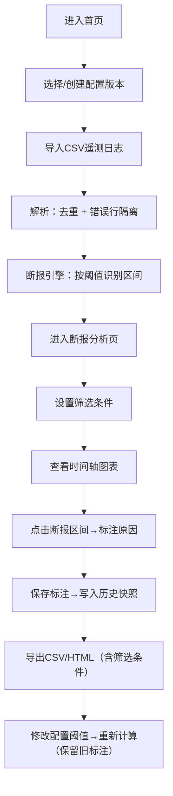

## 1. 产品概述

站点传感器断报分析工具是一个面向运维和数据分析人员的本地Web应用，用于导入遥测日志、自动识别传感器断报区间、人工标注断报原因，并生成可复核的图表与HTML/CSV报告。所有数据本地持久化存储，无需后端服务。

- **主要用途**：批量分析站点遥测日志，识别通信中断/数据缺失区间，追溯历史标注
- **解决问题**：手动排查断报耗时、重复记录干扰、标注无版本追溯、报告不可复核
- **目标用户**：运维工程师、数据分析师、站点管理员

## 2. 核心特性

### 2.1 用户角色

| 角色 | 注册方式 | 核心权限 |
|------|----------|----------|
| 运维/分析人员 | 本地使用，无需注册 | 导入日志、配置规则、标注原因、导出报告、查看历史 |

### 2.2 功能模块

1. **首页仪表盘**：导入入口、统计概览、配置版本切换、快捷导出
2. **日志导入与解析**：多文件批量导入、重复行去重、错误行隔离（时间倒置/字段缺失）
3. **断报分析引擎**：基于可配置阈值识别断报区间、站点分组聚合、异常类型分类
4. **图表可视化**：时间轴断报分布图、站点健康度热力图、筛选条件联动导出
5. **标注与历史版本**：人工标注断报原因、配置版本化、历史标注快照保留
6. **报告中心**：错误行报告、HTML完整报告、CSV数据导出，均携带筛选条件元数据
7. **配置管理**：断报阈值、站点分组、异常类型字典的增删改查与版本发布

### 2.3 页面详情

| 页面名称 | 模块名称 | 功能描述 |
|----------|----------|----------|
| 首页仪表盘 | 顶部导航 | 配置版本切换、导出入口、样例数据一键生成 |
| 首页仪表盘 | 统计概览卡片 | 导入文件数、总记录数、断报区间数、错误行数、标注完成率 |
| 首页仪表盘 | 文件导入区 | 拖拽/点击上传多CSV文件、显示解析进度、重复行统计 |
| 断报分析页 | 筛选条件面板 | 时间范围、站点分组、异常类型、标注状态多选筛选 |
| 断报分析页 | 断报时间轴图 | 可视化展示各站点断报区间，点击跳转标注弹窗 |
| 断报分析页 | 站点健康度表 | 按站点分组的断报统计、平均断报时长、最近断报时间 |
| 标注弹窗 | 断报区间详情 | 显示起止时间、持续时长、异常类型、历史标注对比 |
| 标注弹窗 | 标注表单 | 下拉选择原因、文本备注、保存后写入历史快照 |
| 配置管理页 | 阈值配置 | 断报阈值（分钟）、重复行判定字段、时间字段格式 |
| 配置管理页 | 站点分组 | 分组名称、包含站点列表、拖拽排序 |
| 配置管理页 | 异常类型 | 类型编码、名称、颜色标签、默认原因模板 |
| 报告中心页 | 错误报告 | 时间倒置行、字段缺失行表格，支持单独导出 |
| 报告中心页 | 导出列表 | 历史导出记录（文件名、时间、筛选条件快照），点击重新下载 |

## 3. 核心流程

**主要用户流程说明**：
1. 用户首次进入时使用默认配置版本 v1，可一键生成样例数据体验
2. 导入CSV文件后，解析器先按（站点ID+时间戳）去重，再将时间倒置行和字段缺失行写入错误报告库
3. 断报引擎按站点分组，将记录按时间排序，相邻记录间隔>阈值即标记为断报区间
4. 用户在图表上点击断报区间，弹出标注窗口，选择原因并备注，保存时会记录当前配置版本号
5. 导出报告时，将当前筛选条件序列化为元数据嵌入导出文件，便于后续复核
6. 切换/修改配置版本后，断报区间重新计算，但旧标注按旧配置版本号保留，可在历史面板查看

## 4. 用户界面设计

### 4.1 设计风格

- **主色调**：深空蓝 `#0B1F3A`（背景）+ 信号青 `#00D4FF`（主强调）+ 告警橙 `#FF8A3D`（断报）+ 故障红 `#FF4D6D`（错误）
- **辅助色**：成功绿 `#36D399`、历史黄 `#FBBF24`、中性灰 `#64748B`
- **按钮风格**：扁平直角、2px描边、悬停时背景色微亮 + 1px发光投影
- **字体**：标题使用 `Orbitron`（科技感等宽），正文使用 `JetBrains Mono`（等宽便于对齐时间戳）
- **布局风格**：左侧固定导航 + 右侧内容卡片网格，卡片带极细青色边框 + 内部暗色渐变
- **图标风格**：使用 SVG 线性图标，统一描边宽度 1.5px，主色填充

### 4.2 页面设计概览

| 页面名称 | 模块名称 | UI 元素 |
|----------|----------|---------|
| 首页仪表盘 | 统计卡片 | 4列网格卡片，左上大数字、右上趋势小箭头、底部描述，卡片底部1px青色渐变条 |
| 首页仪表盘 | 文件导入区 | 虚线拖拽框，拖入后文件以标签形式排列，进度条在标签下方 |
| 断报分析页 | 时间轴图 | 横向甘特图风格，Y轴站点、X轴时间、断报区间以橙色色块显示，标注后变色为绿色 |
| 断报分析页 | 筛选面板 | 固定在顶部的半透明条，下拉多选带搜索，筛选条件以Tag形式回显 |
| 配置管理页 | 配置表格 | 交替行背景，操作列固定在右侧，保存按钮有"发布新版本"二次确认 |
| 标注弹窗 | 历史对比 | 左右分栏：左侧当前配置标注、右侧历史配置标注列表，时间降序 |

### 4.3 响应式设计

- 桌面优先（≥1440px）：左侧导航 240px，内容区自适应
- 平板（768-1439px）：导航折叠为图标模式（60px），图表缩放
- 移动（<768px）：导航抽屉式，统计卡片改为2列，图表纵向滚动
- 关键交互（拖拽上传、筛选多选）在触摸屏上提供替代按钮操作

### 4.4 动效与氛围

- 页面加载：统计数字从0滚动到目标值（600ms缓动）
- 断报区间悬停：色块扩展2px宽度 + 青色光晕脉冲
- 标注保存成功：弹窗顶部绿色滑入提示条，800ms后淡出
- 配置版本切换：内容区整体轻微左移+渐隐，再从右侧渐入
- 背景：深空蓝底 + 0.5px的网格点阵（间距24px）+ 顶部微弱青色光晕
