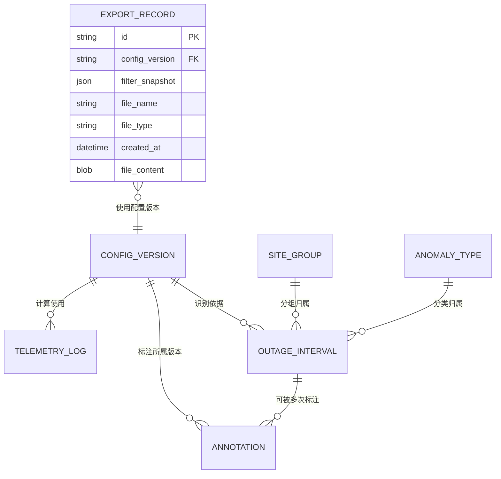

## 1. 架构设计


## 2. 技术选型说明

| 领域 | 技术 | 版本 | 理由 |
|------|------|------|------|
| 前端框架 | React | 18.2 | 生态成熟，状态管理方便 |
| 构建工具 | Vite | 5.0 | 冷启动快，HMR流畅 |
| 语言 | TypeScript | 5.4 | 类型安全，避免解析逻辑出错 |
| 样式 | Tailwind CSS | 3.4 | 原子化CSS，开发效率高 |
| 本地数据库 | Dexie.js | 4.0 | IndexedDB 优雅封装，支持版本迁移 |
| 图表 | Recharts | 2.12 | React 原生，时间轴甘特图可定制 |
| 图标 | Lucide React | 0.37 | 线性图标，符合科技感风格 |
| CSV解析 | Papaparse | 5.4 | 流式解析大文件，支持错误行回调 |

## 3. 路由定义

| 路由 | 页面组件 | 用途 |
|------|----------|------|
| `/` | `Dashboard` | 首页仪表盘：导入、统计、快捷操作 |
| `/analysis` | `Analysis` | 断报分析：筛选、图表、标注入口 |
| `/config` | `Config` | 配置管理：阈值、分组、异常类型 |
| `/reports` | `Reports` | 报告中心：错误行、历史导出记录 |

## 4. 核心数据模型

### 4.1 ER 图



### 4.2 IndexedDB Schema（Dexie 版本）

```typescript
// ===== 表：配置版本 =====
interface ConfigVersion {
  id: string;                // 如 "v1", "v2"
  name: string;              // 版本别名
  createdAt: number;
  isActive: boolean;
  thresholdMinutes: number;  // 断报阈值，默认30分钟
  dedupeFields: string[];    // 重复判定字段，默认['siteId','timestamp']
  timeField: string;         // 时间字段名，默认'timestamp'
  timeFormat: string;        // ISO或自定义格式，默认'ISO'
  siteGroups: SiteGroup[];
  anomalyTypes: AnomalyType[];
}

interface SiteGroup {
  id: string;
  name: string;
  siteIds: string[];
}

interface AnomalyType {
  code: string;              // 如 'COMM_LOST','SENSOR_FAULT'
  name: string;
  color: string;
  defaultReason?: string;
}

// ===== 表：遥测日志（去重后） =====
interface TelemetryLog {
  id: string;                // 基于dedupeFields生成的hash
  siteId: string;
  timestamp: number;         // 解析后的毫秒时间戳
  rawTimestamp: string;      // 原始时间字符串
  [key: string]: any;        // 其他传感器字段
  sourceFile: string;        // 来源文件名
  importBatchId: string;     // 本次导入批次ID
}

// ===== 表：错误行 =====
interface ErrorRow {
  id: string;
  sourceFile: string;
  lineNumber: number;
  errorType: 'TIME_INVERSION' | 'MISSING_FIELD' | 'PARSE_ERROR';
  errorMessage: string;
  rowData: string;           // 原始行数据（CSV字符串）
  importBatchId: string;
  createdAt: number;
}

// ===== 表：断报区间（按配置版本计算） =====
interface OutageInterval {
  id: string;                // configVersion + siteId + start 组合hash
  configVersion: string;
  siteId: string;
  siteGroupId: string;
  anomalyTypeCode: string;
  startTime: number;
  endTime: number;
  durationMinutes: number;
  firstLogId?: string;       // 断报前最后一条正常记录
  lastLogId?: string;        // 恢复后第一条正常记录
}

// ===== 表：标注历史 =====
interface Annotation {
  id: string;
  outageIntervalId: string;
  configVersion: string;     // 冗余，便于查询旧版本标注
  reasonCode: string;        // 如 'POWER_OUTAGE','MAINTENANCE'
  reasonText: string;        // 具体原因描述
  remark: string;            // 自由备注
  annotatedAt: number;
  annotatedBy: string;       // 默认'local-user'
  isCurrent: boolean;        // 是否为当前配置版本的标注
}

// ===== 表：导出记录 =====
interface ExportRecord {
  id: string;
  fileName: string;
  fileType: 'CSV' | 'HTML';
  configVersion: string;
  filterSnapshot: FilterState;  // 导出时的筛选快照
  summary: {
    totalIntervals: number;
    annotatedCount: number;
    dateRange: [number, number];
  };
  fileContent: Blob;
  createdAt: number;
}
```

## 5. 核心算法流程

### 5.1 日志解析与去重

```
输入: CSV文件列表
输出: 写入TelemetryLog + ErrorRow
步骤:
  1. 遍历文件，PapaParse流式逐行读取
  2. 对每行：
     a. 检查必填字段（siteId、timestamp、至少一个传感器值）
        → 缺失 → ErrorRow{MISSING_FIELD}，continue
     b. 解析时间戳 → 失败 → ErrorRow{PARSE_ERROR}，continue
     c. 与前一行（同一站点）比较时间戳，若当前<前一个
        → ErrorRow{TIME_INVERSION}，continue（但仍记录该行到日志？——需求是进入错误报告，不中断分析 → 建议：该行继续参与后续排序，错误行仅做报告）
     d. 基于dedupeFields生成hash，若已存在于本批次→标记重复、跳过
  3. 整批完成后，将去重日志批量入库
```

### 5.2 断报区间识别

```
输入: 配置版本cv、时间范围[from,to]
输出: OutageInterval列表
步骤:
  1. 从TelemetryLog按siteId分组，每组内按timestamp升序排序
  2. 对每个站点的排序后记录：
     for i from 1 to len(logs)-1:
       gap = logs[i].timestamp - logs[i-1].timestamp
       if gap > cv.thresholdMinutes * 60 * 1000:
         创建OutageInterval:
           startTime = logs[i-1].timestamp
           endTime   = logs[i].timestamp
           durationMinutes = gap/60000
           anomalyTypeCode = 默认'COMM_LOST'（可在UI中修改分类）
           siteGroupId     = 匹配cv.siteGroups中包含该siteId的组
  3. 对所有区间按startTime排序，返回
```

### 5.3 配置版本变更与标注保留

```
场景：用户修改阈值→发布新版本v2→重新计算断报区间
规则:
  1. 旧v1的OutageInterval保留不删
  2. 旧v1的Annotation.isCurrent置为false（但保留，在历史面板可见）
  3. 新计算v2的OutageInterval，尝试按（siteId+startTime容差1分钟）匹配旧标注
     → 匹配成功 → 复制一份Annotation到v2，isCurrent=true
     → 匹配失败 → 无标注，等待用户重新标注
```

## 6. 状态管理（Zustand）

使用 Zustand 存储全局筛选状态，确保刷新前后筛选一致（持久化到 localStorage）：

```typescript
interface FilterState {
  configVersion: string;
  timeRange: [number, number] | null;
  siteGroupIds: string[];
  anomalyTypeCodes: string[];
  annotationStatus: 'ALL' | 'ANNOTATED' | 'UNANNOTATED';
  // 序列化方法：用于导出快照
  serialize(): string;
  static deserialize(s: string): FilterState;
}
```

## 7. 项目目录结构

```
src/
├── components/        # UI组件（Nav、StatCard、FileDropZone、TimelineChart...）
├── pages/             # 路由页面（Dashboard/Analysis/Config/Reports）
├── stores/            # Zustand stores
├── db/                # Dexie schema + 封装API
├── services/          # 解析器、分析引擎、导出器
├── types/             # TypeScript接口定义
├── utils/             # hash、时间格式化等工具
├── sample/            # 样例数据生成器
└── styles/            # 全局样式、Tailwind变量
```
